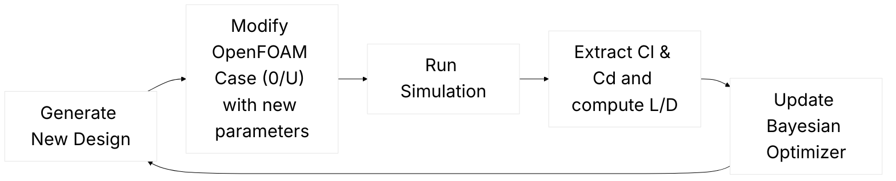

Back in 2024, I had the pleasure of advising Mr. [Daniel Virokannas](https://www.linkedin.com/in/danielvirokannas/) on his Master's thesis, [Bayesian optimization of in-situ adaptive tabulation for marine engine CFD simulations](https://aaltodoc.aalto.fi/server/api/core/bitstreams/d99091dd-25cb-4e66-9233-06cbee0229ac/content). 

He applied Bayesian Optimization to fine-tune input parameters for in-situ adaptive tabulation in chemistry computations, achieving a balance between performance and accuracy for internal combustion engine simulations. Daniel’s work was exceptional, delivering results that are still in use today. Beyond the thesis, he also made the optimization framework open source as [FlowBoost](https://github.com/499602D2/flowboost).

FlowBoost is a modular, cluster-native framework for optimizing OpenFOAM CFD simulations using Bayesian methods. It provides a high-level abstraction for managing OpenFOAM cases, supports multi-objective optimization via Meta’s [Ax](https://ax.dev/) platform, and can interface with any optimizer through simple backend bindings. Designed for flexibility and scalability, FlowBoost allows users to run hands-off, high-dimensional optimization campaigns, from simple tutorial cases to complex engine simulations, making it a powerful tool for CFD researchers and engineers.

After Daniel moved on to other fields, FlowBoost sat on my desk for almost two years, until I suddenly needed a tool for design optimization. It turned out to be exactly what I needed, though there were a number of issues that needed fixing. I [forked the repository](https://github.com/blttkgl/flowboost) and started working through them, gradually getting it fully operational and tailored for my CFD workflows.

With FlowBoost ready to go, I could finally tackle one of the most common questions in CFD: how to run design optimization studies, in particular in OpenFOAM. In this article, I’ll walk through the key steps, from setting up your case and defining objectives, to running automated optimization campaigns, and showing how a structured workflow can save time and uncover better designs more efficiently.

Before diving into the specifics of running design optimization in OpenFOAM, it’s worth noting that I’ve tackled design optimization problems in CFD before. One example is the work on “[Design Optimization of an Ethanol Heavy‑Duty Engine](https://asmedigitalcollection.asme.org/gasturbinespower/article/145/10/101001/1164119/Design-Optimization-of-an-Ethanol-Heavy-Duty)” published in 2023. In that study, we used a combination of design of experiments (DoE) and Bayesian optimization to explore the design space of a heavy‑duty compression‑ignition engine running on ethanol. We parameterized features such as piston bowl geometry and spray targeting angle, leveraged CFD simulations to evaluate hundreds of candidate designs, and identified configurations that increased indicated thermal efficiency by a few percentage points while meeting operational constraints. Unlike that workflow, which relied on licensed tools like [CAESES](https://www.caeses.com) and [CONVERGE](https://convergecfd.com), OpenFOAM and FlowBoost are fully open source, providing much more flexibility for custom workflows and experimentation.

Finally, before we get into the workflow, a quick note on Bayesian optimization. I won’t go into the mathematical details here, but at a high level, it’s an approach that efficiently explores a design space by learning from previous simulation results. Instead of testing every possible combination of parameters, it predicts which new designs are most likely to improve your objectives, striking a balance between exploration and exploitation. This makes it particularly well suited for computationally expensive CFD simulations, where evaluating every candidate design would be prohibitively costly.


<figure>
  
  <figcaption>Bayesian Optimization using Gaussian Processes (source: Wikimedia Commons)</figcaption>
</figure>

# Defining the problem

Before starting any design optimization, the first step is to define **what you are optimizing**. This involves two key elements:

- **Design variables (dimensions)**: These are the parameters you can change in your system. For example, in a CFD case, this could include geometric features like the piston bowl shape, inlet guide vane angle, or nozzle diameter, or operational parameters like injection timing or boundary conditions.

- **Objective function**: This is the quantity you want to maximize or minimize. Typical examples include:

  - Maximizing efficiency: Increasing indicated or thermal efficiency of an engine.

  - Minimizing pressure drop: Reducing losses in a duct or heat exchanger.

  - Maximizing lift-to-drag ratio: For an airfoil or wing section.

  - Minimizing peak temperature: To avoid thermal stress or reduce NOx formation.

A well-defined problem clearly specifies which parameters can vary, their feasible ranges, and the target objectives. This forms the foundation for running an effective optimization campaign.

# Our problem: NACA0012 Airfoil

For this article, I wanted a problem that’s small and accessible enough for anyone to replicate on their own computer. I chose the 2D NACA0012 Steady tutorial from OpenFOAM, which simulates flow over a NACA0012 airfoil at low Mach numbers.

In this setup, the airfoil is placed in a rectangular computational domain with uniform inlet velocity and simple boundary conditions on the top, bottom, and far-field boundaries. The flow is modeled as incompressible and laminar, and the solver computes the steady-state pressure and velocity fields around the airfoil.

This problem is ideal for demonstrating design optimization because it has:

- **Clear objectives**: such as minimizing drag or maximizing lift.

- **Simple geometry**: a single 2D airfoil that can be parameterized easily (e.g., by angle of attack).

- **Fast runtimes**: simulations can run in few minutes, making it perfect for iterative optimization campaigns with FlowBoost.

You can check out the tutorial case [here](https://github.com/OpenFOAM/OpenFOAM-dev/tree/master/tutorials/fluid/aerofoilNACA0012Steady)
 and follow along step by step.

## Defining Design Variables and Objectives

For our NACA0012 airfoil case, we’ll define two design variables:

- **Angle of Attack (AoA)** – The orientation of the airfoil relative to the incoming flow. Small changes in AoA can significantly affect both lift and drag.

- **Inlet Flow Speed** – The uniform velocity of the air entering the domain. This affects the Reynolds number and the overall aerodynamic forces on the airfoil.

Our objective will be to maximize the **lift-to-drag ratio (L/D)**. This captures the airfoil’s aerodynamic efficiency: we want the airfoil to generate as much lift as possible while minimizing drag. Using L/D as the target ensures the optimizer favors designs that are both strong and efficient, rather than simply increasing lift at the cost of excessive drag.

With the problem defined and the design variables set, we’re ready to link the OpenFOAM case to FlowBoost and set up the optimization campaign.

## Setting up the OpenFOAM case for FlowBoost
### Step 1: Prepare the baseline case

Start with the OpenFOAM NACA0012Steady tutorial. Make sure the case runs to completion and produces reasonable lift and drag values. This ensures that your baseline is stable before introducing parameter variations.

When I do that on my end, I see that the case has an Angle of Attack of degrees, and speed is 250 m/s, both defined for velocity boundary condition, located at **0/U** :


```bash
/*--------------------------------*- C++ -*----------------------------------*\
  =========                 |
  \\      /  F ield         | OpenFOAM: The Open Source CFD Toolbox
   \\    /   O peration     | Website:  https://openfoam.org
    \\  /    A nd           | Version:  dev
     \\/     M anipulation  |
\*---------------------------------------------------------------------------*/
FoamFile
{
    format      ascii;
    class       volVectorField;
    location    "0";
    object      U;
}
// * * * * * * * * * * * * * * * * * * * * * * * * * * * * * * * * * * * * * //

speed           250;
angleOfAttack   0; // degs

#codeBlock
#codeInclude    "transform.H"
angle           #calc "-degToRad($angleOfAttack)";
liftDir         #calc "transform(Ry($<scalar>angle), vector(0, 0, 1))";
dragDir         #calc "transform(Ry($<scalar>angle), vector(1, 0, 0))";

Uinlet          #calc "$speed*$<vector>dragDir";
#endCodeBlock

dimensions      [0 1 -1 0 0 0 0];

internalField   uniform $Uinlet;

boundaryField
{
    freestream
    {
        type            freestreamVelocity;
        freestreamValue uniform $Uinlet;
        value           uniform $Uinlet;
    }

    wall
    {
        type            noSlip;
    }

    #includeEtc "caseDicts/setConstraintTypes"
}

// ************************************************************************* //

```

This is very good news, because the two parameters we would like to investigate are already configured and parametrised, we just need to change them!

There is also a function object that writes the drag and lift coefficient for us, into **postProcessing/forceCoeffsCompressible/0/forceCoeffs.dat**:

|  |  |
|:-------------------------:|:-------------------------:|
| **Drag**                  | **Lift**                  |


Looks like we can get to the next step!

### Step 2: Parameterize the design variables

Let's start getting our hands dirty with FlowBoost. I will introduce everything block by block, and explain step by step.

#### 1. Imports and Setup

```python
from pathlib import Path
import warnings

import coloredlogs
import polars as pl

from flowboost.manager.manager import Manager
from flowboost.openfoam.case import Case
from flowboost.openfoam.dictionary import Dictionary
from flowboost.optimizer.objectives import Objective
from flowboost.optimizer.search_space import Dimension
from flowboost.session.session import Session
```

- Path, warnings – Standard Python modules for file paths and suppressing warnings.

- coloredlogs – Provides nicely formatted logging output.

- polars – Fast DataFrame library used for handling OpenFOAM function object outputs.

- flowboost modules – Import the main components of FlowBoost:

   - Manager → handles running simulations locally or on a cluster.

   - Case → represents an OpenFOAM case template that can be cloned and modified.

   - Dictionary → lets you access and edit OpenFOAM dictionary entries.

   - Objective → defines what you want to optimize.

   - Dimension → defines the range or choices of design variables.

   - Session → manages the entire optimization workflow.

#### 2. Define the Objective Function
```python
def max_lift_drag_objective(case: Case):
    my_func_obj = "forceCoeffsCompressible"
    dataframe = case.data.simple_function_object_reader(my_func_obj)

    if dataframe is None:
        return None

    last_cl = dataframe.select(pl.last("Cl")).item()
    last_cd = dataframe.select(pl.last("Cd")).item()

    return last_cl / last_cd
```

- This function tells FlowBoost how to evaluate the “goodness” of each simulation.

- Reads lift (Cl) and drag (Cd) from the OpenFOAM function object forceCoeffsCompressible.

- Computes lift-to-drag ratio (L/D), which we are trying to maximize.

- If no data is available (e.g., simulation failed), it returns None so FlowBoost can handle it.

**Tip for readers**: Your objective function can compute any derived metric you want, like max pressure, efficiency, or temperature limits.

#### 3. Start a FlowBoost Session

```python
session = Session(
    name="aerofoilNACA0012Steady",
    data_dir=data_dir,
    clone_method="copy",
    max_evaluations=50
)
```

- Creates a new optimization session that will track all cases and results.

- clone_method="copy" → FlowBoost makes copies of the template case for each new trial.

- max_evaluations=50 → the optimizer will try up to 50 designs.


#### 4. Define the Template OpenFOAM Case
```python
case_dir = Path(data_dir, "aerofoilNACA0012Steady_template")
naca_case = Case.from_tutorial("fluid/aerofoilNACA0012Steady", case_dir, method="copy")
session.attach_template_case(case=naca_case)
```

- Case.from_tutorial → loads the NACA0012 tutorial as a template case.

- attach_template_case → links it to the session so FlowBoost can create multiple clones and modify design variables automatically.

#### 5. Define the Optimization Objective
```python
objective = Objective(
    name="L/D",
    minimize=False,
    objective_function=max_lift_drag_objective,
    normalization_step="yeo-johnson",
)
session.backend.set_objectives([objective])

```
Tells FlowBoost:

- Name: "L/D"

- maximize (not minimize)

- objective function: the Python function defined earlier

- normalization: “Yeo-Johnson” scales values for more efficient Bayesian optimization.

#### 6. Define the Design Variables (Search Space)

```python
# Angle of attack dimension
entry_link_aoa = Dictionary.link("0/U").entry("angleOfAttack")
aoa_dim = Dimension.range(
    name="angleOfAttack",
    link=entry_link_aoa,
    lower=-20,
    upper=40,
    log_scale=False
)

# Speed dimension
entry_link_speed = Dictionary.link("0/U").entry("speed")
speed_dim = Dimension.choice(
    name="speed",
    link=entry_link_speed,
    choices=[10, 15, 20]
)

session.backend.set_search_space([aoa_dim, speed_dim])
```

- Angle of Attack (AoA): continuous range from -20° to 40°.

- Speed: discrete choice of 10, 15, 20 m/s.

- Dictionary.link points to the dictionary entry in the OpenFOAM case (0/U) that will be modified automatically.

- This defines the design space for the optimizer.

#### 7. Configure Job Management
```python
scheduler = "Local"

if not session.job_manager:
    session.job_manager = Manager.create(
        scheduler=scheduler,
        wdir=session.data_dir,
        job_limit=5
    )
session.job_manager.monitoring_interval = 10
session.backend.initialization_trials = 4
session.clean_pending_cases()
session.start()
```

- Job manager: controls how simulations are run.

- scheduler="Local" → runs jobs on your own computer (can switch to "slurm" for clusters).

- job_limit=5 → up to 5 parallel simulations at a time.

- initialization_trials=4 → FlowBoost starts with 4 random designs sampled with Sobol sampling, to “learn” the space.

- clean_pending_cases() → removes unfinished or failed cases from previous runs.

- start() → begins the optimization campaign.




Now when you run [this script](/images/aerofoilNACA0012Steady.py) with ```python aerofoilNACA0012Steady.py``` it will start the optimization session.

## Understanding the ```flowboost_data ```  Folder Structure
The ```flowboost_data``` directory organizes all the data, cases, and configuration files for your aerofoil optimization session ```aerofoilNACA0012Steady```. Its structure is designed to separate templates, completed cases, pending cases, and design metadata in a way that makes automated CFD workflows manageable and reproducible.

```
flowboost_data/
├── aerofoilNACA0012Steady_template/
├── cases_completed/
├── cases_pending/
├── designs.json
├── flowboost_config.toml
└── job_tracking_Local.json
```

### 1. ```aerofoilNACA0012Steady_template/```

This folder contains the template case for new simulations. Every new design is initially based on this template, which we configure in the FlowBoost script.

### 2. ```cases_completed/```

This folder contains **finished simulation cases**. Each completed design has a unique folder name, e.g.:

```
job_00001_6f5d75a5
job_00002_8a0cac16
```

### 3. ```cases_pending/```

This folder contains cases that are **either running or queued for execution**. Each pending case has a similar structure to completed cases.

Each pending case has a ```metadata.toml``` file that records:

- The design name and ID

- File system path

- Creation timestamp and generation index

- Status (submitted, running, etc.)

- Optimizer suggestions for each parameter (e.g., angleOfAttack, speed)

This allows the optimization system to track which designs are in progress and which values were proposed by the optimizer.

### 3. ```designs.json```

This JSON file is the central record of all designs for the session. It includes:

- Session name and timestamp

- Number of designs

- List of design objects with:

- Unique name and generation index

- Creation time

- Parameters used (angleOfAttack, speed)

- Objectives evaluated (e.g., L/D ratio)

Example entry:

```
{
  "name": "job_00001_6f5d75a5",
  "generation_index": "00001.01",
  "parameters": {
    "angleOfAttack": -3.00766,
    "speed": 20
  },
  "objectives": {
    "L/D": { "value": -25.4593, "minimize": false }
  }
}
```

This file is essential for **tracking the entire design history** and serves as the basis for generating new optimizer suggestions.

### 4. flowboost_config.toml

This is the main configuration file for the session.

- Session paths define where designs are stored and where completed cases are archived.

- Optimizer section specifies the backend used (here AxBackend).

- Scheduler section controls local job execution (job_limit = 5).

```
[session]
name = "aerofoilNACA0012Steady"
data_dir = "flowboost_data"
case_dir = "flowboost_data/cases_pending"
archival_dir = "flowboost_data/cases_completed"
dataframe_format = "polars"
created_at = "2026-02-21T18:17:16"

[template]
path = "/home/blttkgl/flowboost/examples/aerofoilNACA0012Steady/flowboost_data/aachenBomb_template"
additional_files = []

[optimizer]
type = "AxBackend"
offload_acquisition = false

[scheduler]
type = "Local"
job_limit = 5
```


### 5. job_tracking_Local.json

Tracks currently running or queued jobs in the local scheduler:
```
{
  "type": "Local",
  "wdir": "/home/blttkgl/flowboost/examples/aerofoilNACA0012Steady/flowboost_data",
  "job_limit": 5,
  "job_pool": [
    {
      "id": "80274",
      "name": "flwbst_job_00015_1b285b0e",
      "wdir": "/home/blttkgl/.../cases_pending/job_00015_1b285b0e",
      "created_at": "2026-02-21T18:47:51"
    },
    ...
  ],
  "acquisition_job": null
}
```

- job_pool lists all active simulation jobs.

- Each entry points to the corresponding pending case folder.

- job_limit ensures that no more than 5 jobs run simultaneously.


## How it all fits together

- **New design**: The optimizer proposes a design with specific angleOfAttack and speed.

- **Pending case**: The system copies the aachenBomb_template to cases_pending/job_xxxxx and updates the OpenFOAM dictionaries. Metadata is saved in metadata.toml.

- **Simulation runs**: The case executes, producing OpenFOAM results.

- **Completion**: Once finished, the case is moved to cases_completed/ and objectives (like L/D) are recorded in designs.json.

- **Next iteration**: The optimizer reads designs.json to suggest new designs.

This structure ensures modularity, reproducibility, and easy tracking of hundreds of designs in an automated CFD optimization workflow.

### Running FlowBoost on SLURM cluster
So far, we’ve configured FlowBoost with:

```python
scheduler = "Local"
```

That’s perfect for laptops or small workstations. But let’s be honest, the moment your cases become even slightly more expensive (3D, turbulence, combustion, mesh refinement…), your CPU will start begging for mercy.

This is where a SLURM-based HPC cluster becomes your best friend.

FlowBoost abstracts job execution through its Manager, which means switching to a cluster environment is straightforward.

Instead of:

```python
scheduler = "Local"
```

you can use

```python
scheduler = "slurm"
```

Then configure the manager:

```python
session.job_manager = Manager.create(
    scheduler="slurm",
    wdir=session.data_dir,
    job_limit=20  # or whatever your allocation allows
)
```

Now each OpenFOAM case is submitted as a SLURM job instead of running locally.

Note that you can also explicitly specify the name of your run script, which you configured for SLURM:

```python
session.job_manager = Manager.create(
    scheduler="slurm",
    wdir=session.data_dir,
    job_limit=20  # or whatever your allocation allows
)
session.submission_script_name = "Allrun_SLURM"
```
— Bulut


