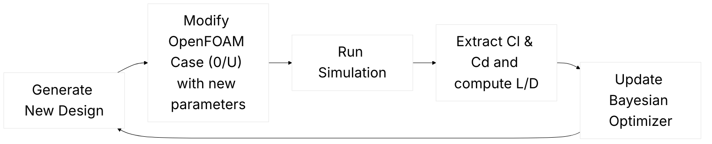

Running design optimization in CFD is usually slow, tedious, and expensive. This is especially true when you have many design variables and rely on traditional design of experiments (DoE), which can require **an enormous number of simulations** to explore the space.

What if you could **automate the process, explore hundreds of design variations efficiently, and find optimal designs**, all using open-source tools like OpenFOAM? Then this article is for you 😊

[FlowBoost](https://github.com/499602D2/flowboost) is an open-source framework for automating design optimization in OpenFOAM. It can modify cases, run simulations locally or on a cluster, track results, and suggest new designs, letting you focus on insight rather than manual trial and error.

Originally developed in 2024 by [Daniel Virokannas](https://www.linkedin.com/in/danielvirokannas/) on his Master's thesis which I acted as an advisor, [Bayesian optimization of in-situ adaptive tabulation for marine engine CFD simulations](https://aaltodoc.aalto.fi/server/api/core/bitstreams/d99091dd-25cb-4e66-9233-06cbee0229ac/content), FlowBoost have since been [open-sourced](https://github.com/499602D2/flowboost) and been living on GitHub since then. After I [forked](https://github.com/blttkgl/flowboost) and polished it for my own CFD workflows (introducing new functionality, squashing some bugs), it became a useful tool for automated design campaigns, from simple tutorial problems to complex cases.

In this article, I’ll show you how to **set up an OpenFOAM case for optimization, define objectives, and run automated campaigns**, all illustrated with a simple, reproducible NACA0012 airfoil example.<br><br>

# Part 1: Defining the Problem & Our Airfoil Case

Before starting any design optimization, you need to clearly define **what you are optimizing**:

- **Design variables (dimensions)**: The parameters you can change, e.g., piston bowl shape, nozzle diameter, angle of attack, or inlet velocity.

- **Objective function**: What you want to maximize or minimize, such as:
  - Lift-to-drag ratio (airfoils)

  - Thermal efficiency (engines)

  - Pressure drop (ducts or heat exchangers)

  - Peak temperature (avoid thermal stress or reduce NOx)

A well-defined problem specifies **which parameters vary**, their feasible ranges, and the **target objectives**. This is your foundation for effective optimization.

## Our problem: NACA0012 Airfoil

To keep things simple and reproducible, we’ll use the NACA0012 Steady OpenFOAM tutorial, simulating low-Mach laminar flow over a 2D airfoil.

**Why this case works well for optimization**:

- **Clear objectives**: minimize drag, maximize lift, or optimize L/D ratio.

- **Simple geometry**: a single 2D airfoil that can be parameterized easily (e.g., by angle of attack).

- **Fast runtimes**: each simulation takes minutes, perfect for iterative optimization.

You can follow along with the tutorial [here](https://github.com/OpenFOAM/OpenFOAM-dev/tree/master/tutorials/fluid/aerofoilNACA0012Steady).

## Design Variables and Objective

For our NACA0012 airfoil case, we define **two design variables**:

- **Angle of Attack (AoA)** – the orientation of the airfoil relative to flow. Small changes can greatly affect lift and drag.

- **Inlet Flow Speed** – the uniform velocity entering the domain, affecting Reynolds number and aerodynamic forces.

**Objective**: Maximize the l**ift-to-drag ratio (L/D)**, rewarding designs that are both strong and efficient, not just high-lift designs with massive drag.

I picked this tutorial specifically because the two parameters we will change are already parametrized, and a function object for lift and drag coefficients is already set up:


In  **0/U** :


```bash
/*--------------------------------*- C++ -*----------------------------------*\
  =========                 |
  \\      /  F ield         | OpenFOAM: The Open Source CFD Toolbox
   \\    /   O peration     | Website:  https://openfoam.org
    \\  /    A nd           | Version:  dev
     \\/     M anipulation  |
\*---------------------------------------------------------------------------*/
FoamFile
{
    format      ascii;
    class       volVectorField;
    location    "0";
    object      U;
}
// * * * * * * * * * * * * * * * * * * * * * * * * * * * * * * * * * * * * * //

speed           250;
angleOfAttack   0; // degs

#codeBlock
#codeInclude    "transform.H"
angle           #calc "-degToRad($angleOfAttack)";
liftDir         #calc "transform(Ry($<scalar>angle), vector(0, 0, 1))";
dragDir         #calc "transform(Ry($<scalar>angle), vector(1, 0, 0))";

Uinlet          #calc "$speed*$<vector>dragDir";
#endCodeBlock

dimensions      [0 1 -1 0 0 0 0];

internalField   uniform $Uinlet;

boundaryField
{
    freestream
    {
        type            freestreamVelocity;
        freestreamValue uniform $Uinlet;
        value           uniform $Uinlet;
    }

    wall
    {
        type            noSlip;
    }

    #includeEtc "caseDicts/setConstraintTypes"
}

// ************************************************************************* //

```

and in **postProcessing/forceCoeffsCompressible/0/forceCoeffs.dat**:


|  |  |
|:-------------------------:|:-------------------------:|
| **Drag**                  | **Lift**                  |


Looks like we can get to the next step!<br><br>


# Part 2: Linking OpenFOAM to FlowBoost

Once the problem and design variables are defined, the next step is c**onnecting your OpenFOAM case to FlowBoost** and telling it how to explore the design space.


## 1. Imports and Setup

```python
from pathlib import Path
import warnings

import coloredlogs
import polars as pl

from flowboost.manager.manager import Manager
from flowboost.openfoam.case import Case
from flowboost.openfoam.dictionary import Dictionary
from flowboost.optimizer.objectives import Objective
from flowboost.optimizer.search_space import Dimension
from flowboost.session.session import Session
```

- Standard Python modules: ```Path``` for file paths, ```coloredlogs``` for logging, ```polars``` for fast DataFrame handling.

- FlowBoost modules: manage sessions, OpenFOAM cases, design variables, objectives, and job execution.

## 2. Define the Objective Function
```python
def max_lift_drag_objective(case: Case):
    my_func_obj = "forceCoeffsCompressible"
    dataframe = case.data.simple_function_object_reader(my_func_obj)

    if dataframe is None:
        return None

    last_cl = dataframe.select(pl.last("Cl")).item()
    last_cd = dataframe.select(pl.last("Cd")).item()

    return last_cl / last_cd
```

- Reads lift (Cl) and drag (Cd) from OpenFOAM’s function object.

- Computes **L/D ratio**, which FlowBoost will try to maximize.

- Returns ```None``` if simulation fails, so FlowBoost can handle it.

## 3. Start a FlowBoost Session

```python
session = Session(
    name="aerofoilNACA0012Steady",
    data_dir=data_dir,
    clone_method="copy",
    max_evaluations=50
)
```

- ```clone_method="copy"``` → each new trial gets a fresh copy of the template case (foamCloneCase can also be used as an option).

- ```max_evaluations=50``` → optimizer will explore up to 50 designs.

## 4. Define the Template OpenFOAM Case
```python
case_dir = Path(data_dir, "aerofoilNACA0012Steady_template")
naca_case = Case.from_tutorial("fluid/aerofoilNACA0012Steady", case_dir, method="copy")
session.attach_template_case(case=naca_case)
```

- Load NACA0012 tutorial as a **template case**.

- FlowBoost clones and modifies this template for each new design automatically.

## 5. Register Optimization Objective
```python
objective = Objective(
    name="L/D",
    minimize=False,
    objective_function=max_lift_drag_objective,
    normalization_step="yeo-johnson",
)
session.backend.set_objectives([objective])
```
- Name: "```L/D```"

- Maximize (not minimize)

- Normalization helps Bayesian optimization converge faster.

## 6. Define Design Variables (Search Space)

```python
# Angle of attack dimension
entry_link_aoa = Dictionary.link("0/U").entry("angleOfAttack")
aoa_dim = Dimension.range(
    name="angleOfAttack",
    link=entry_link_aoa,
    lower=-20,
    upper=40,
    log_scale=False
)

# Speed dimension
entry_link_speed = Dictionary.link("0/U").entry("speed")
speed_dim = Dimension.choice(
    name="speed",
    link=entry_link_speed,
    choices=[10, 15, 20]
)

session.backend.set_search_space([aoa_dim, speed_dim])
```

- **AoA**: continuous from -20° to 40°

- **Speed**: discrete choices 10, 15, 20 m/s

- ```Dictionary.link``` points to OpenFOAM dictionary entries (```0/U```) for automatic updates.

## 7. Configure Job Management
```python
scheduler = "Local"

if not session.job_manager:
    session.job_manager = Manager.create(
        scheduler=scheduler,
        wdir=session.data_dir,
        job_limit=5
    )
session.job_manager.monitoring_interval = 10
session.backend.initialization_trials = 4
session.clean_pending_cases()
session.start()
```

- Scheduler: "```Local```" for your laptop/workstation. Switch to "```slurm```" for clusters.

- ```job_limit=5``` → 5 simulations run in parallel.

- ```initialization_trials=4``` → 4 random Sobol-sampled designs to learn the space (should be much more for more dimensions).

- ```clean_pending_cases()``` → removes unfinished cases.

- ```start()``` → begins the optimization campaign.

## 8. Flow of the Optimization Loop



- Optimizer proposes a design → case is updated → simulation runs → results update optimizer → repeat.

- Fully automated, hands-off CFD optimization.<br><br>

# Part 3: Running the Optimization & Interpreting Results

Once your FlowBoost session is set up, running the optimization is straightforward. [This Python script I prepared](/images/aerofoilNACA0012Steady.py) will handle everything:

```
python aerofoilNACA0012Steady.py
```

FlowBoost will:

1- **Generate new designs**: Suggest new AoA and speed combinations using Bayesian optimization.

2- **Clone the template case**: Copies the NACA0012 template for each design.

3- **Modify parameters**: Updates the OpenFOAM dictionaries (0/U) automatically.

4- **Run simulations**: Executes OpenFOAM cases either locally or on a SLURM cluster.

5- **Evaluate objectives**: Computes L/D for each design from the function object output.

## Watching the Progress

The session creates a clear folder structure:

```
flowboost_data/
├── cases_pending/      # currently running or queued
├── cases_completed/    # finished simulations
├── designs.json        # parameters + results
└── job_tracking_*.json # scheduler info
```

- ```cases_pending/```: Shows which designs are actively running.

- ```cases_completed/```: Each folder contains the OpenFOAM results for a completed design.

- ```designs.json```: Central record — easy to plot, analyze, or feed into further optimization.

## Monitoring Convergence

FlowBoost’s Bayesian optimization balances **exploration vs. exploitation**, meaning early trials explore the parameter space broadly, while later trials focus on promising regions. It will show you all the designs and their objective values in submission order in the log:

```bash
=== All Designs in Submission Order (by 'L/D') ===
Rank   Case Name                           L/D                Parameters
----------------------------------------------------------------------------------------------------
1      job_00001_9ed1b276                  1.263423           angleOfAttack=36.691, speed=20.000
2      job_00002_d0bc95b0                  1.976539           angleOfAttack=18.332, speed=20.000
...
49     job_00049_e5e23487                  60.911612          angleOfAttack=10.565, speed=20.000
```

It will also plot the top 5 designs at instances when a new design is being submitted:

```bash
=== Top 5 Designs (by 'L/D') ===
Rank   Case Name                           L/D                Parameters
----------------------------------------------------------------------------------------------------
1      job_00028_6e81bb60                  60.918293          angleOfAttack=10.688, speed=20.000
2      job_00032_5d2e3a3a                  60.914313          angleOfAttack=10.613, speed=20.000
3      job_00033_3183016f                  60.913708          angleOfAttack=10.599, speed=20.000
4      job_00030_cc7f4089                  60.897189          angleOfAttack=10.641, speed=20.000
5      job_00022_e55c0d4f                  60.894583          angleOfAttack=10.655, speed=20.000
```


 You can also visualize progress by plotting:

- Lift-to-drag ratio vs. trial number

- AoA and speed vs. L/D

using the [```visualise.py```](/images/visualise.py) script I provided you can plot the results, and it even generates a GIF showing the optimization progress, which I may shamelessly show off here 😄

<div style="text-align: center;">
    
</div>

This looks great, but there’s an interesting observation: **the optimizer finds a strong design very early on**, and after that the improvements are marginal. In practice, the optimization has already converged, yet we continue spending computational time evaluating new designs.

One might ask whether this behavior is influenced by the **choice of acquisition function**. For example, if the optimizer is leaning heavily toward *expected improvement* rather than *probability of improvement* ([here is their definitions](https://ekamperi.github.io/machine%20learning/2021/06/11/acquisition-functions.html)), it may aggressively exploit early promising regions instead of continuing broader exploration. At this point, I don’t yet know FlowBoost’s internals well enough to make a definitive call, so this remains an open question worth revisiting if the optimization appears to get “stuck.”

In cases like this, it makes sense to stop the optimization as soon as a target performance is reached. FlowBoost supports this by allowing you to define a **target objective value** and terminate the iteration automatically once it is exceeded:

```python
session = Session(
    name="aerofoilNACA0012Steady",
    data_dir=data_dir,
    clone_method="copy",
    max_evaluations=50,
    target_value=60,
    target_objective="L/D"
)
```
If ```target_objective ```is not specified, FlowBoost defaults to using the first registered objective. This is fine for single-objective problems, but if you are optimizing multiple objectives simultaneously, it’s best practice to always specify which one should trigger early termination.

Now my cool GIF will look like this:

<div style="text-align: center;">
    
</div>

You can see that the optimizer automatically stops **once the target value of 60 is reached**, avoiding unnecessary evaluations after convergence.

## Understanding the Workflow Behind the Scenes

FlowBoost organizes each optimization session in a clear, reproducible structure:

- **Template case** – The base OpenFOAM case that every new design is cloned from.

- **Pending cases** – Designs currently running or queued. FlowBoost automatically updates the parameters in each case.

- **Completed cases** – Finished simulations with all results stored.

- **Central record** (```designs.json```) – Tracks every design’s parameters and evaluated objectives, letting the optimizer learn and suggest new designs efficiently.

This system ensures that hundreds of designs can be explored without losing track of any simulation, and makes it easy to visualize or analyze results at any time.

## Scaling to the HPC Clusters
For small cases, the local scheduler works fine. But for heavier 3D simulations, you can switch to a cluster:

```python
session.job_manager = Manager.create(
    scheduler="slurm",
    wdir=session.data_dir,
    job_limit=20
)
```
FlowBoost will submit each design as a separate cluster job, keeping the same workflow intact. Note that FlowBoost tries to find an Allrun script inside the case, which works well for a tutorial. For more custom applications you can specify a custom run script, making the transition seamless.


```python
session.submission_script_name = "Allrun_SLURM"
```
<br>

# Closing Thoughts

This example intentionally used a simple, fast-running airfoil case to keep the focus on the **design optimization workflow itself**, rather than on CFD setup details. The key takeaway is not the specific result, but how a structured, automated loop, parameterized cases, objective extraction, Bayesian optimization, and early stopping, can make design exploration in OpenFOAM both practical and scalable.

At the moment, FlowBoost is best suited for **parametric optimization** and **does not support topology optimization out of the box**. Extending the workflow to include automated geometry or topology changes remains an interesting and open challenge. If you are aware of robust, open-source tools that integrate well with OpenFOAM for geometry or topology optimization, I would be very happy to hear about them. Contributions in this direction are also very welcome.

Overall, FlowBoost aims to remove much of the friction traditionally associated with CFD-based optimization in OpenFOAM, making it easier to move from ad-hoc trial-and-error studies to reproducible, data-driven design campaigns—using fully open-source tools.

Finally, I want to personally thank **Daniel Virokannas** for the exceptional work he did in developing the original framework. His Master’s thesis laid a solid foundation, and the quality of that work is the reason FlowBoost could be revived, extended, and used productively years later.

You can find my FlowBoost fork, which includes this tutorial, on GitHub [here](https://github.com/blttkgl/flowboost).

Thanks for reading,
— Bulut

